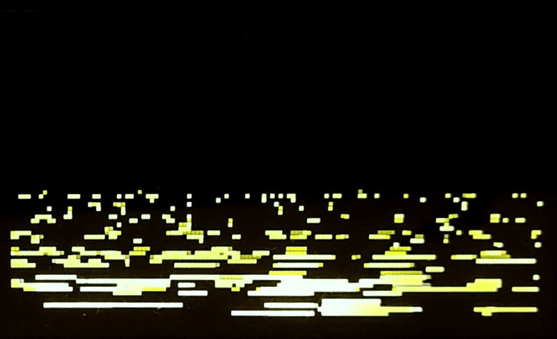

ONG is an ocean noise generator for Monome Norns.

Even by the standards in the Norns ecosystem this script might be considered a bit more experimental than some others.

## dreamers

ONG creates a soundscape that simulates ocean waves rolling in. I sincerely hope the soundscape bring you inner calm and relaxation.

Record it with tape, play other things on top of it. Enjoy, exhale and deflate and let your thoughts get lost.

## realists
There are a few controls to alter the sound, but ultimately it is several noise generators running through filters, being modulated by LFOs.

**Norns controls are:**

* K1 display help
* E1 overall amplitude
* E2 near waves amplitude
* K2+E2 near waves speed
* K3+E2 foam amplitude
* E3 far waves amplitude
* K2+E3 far waves speed
* K3+E3 ambience amplitude

## historians
ONG is my first own script in the Norns universe. I'm dipping my toes into all this, learning Lua and SuperCollider as I go along.

I'm sure when I look at this in a couple of years or months I would structure many things differently, although having debugged the fabulous [Arcologies](https://github.com/northern-information/arcologies) script by [@tyleretters](https://www.instagram.com/tyleretters/) I believe I've already learned a thing or two.

## lawyers
ONG is deeply inspired by the Ocean Noise Generator "guitar" pedal built by [Syntherjack](https://syntherjack.net/ocean-noise-generator/). I'm releasing this software version with permission from them.
